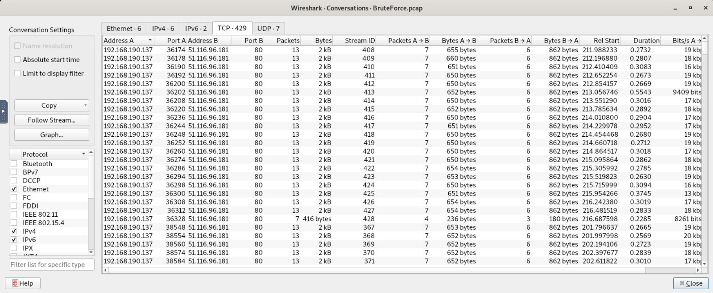
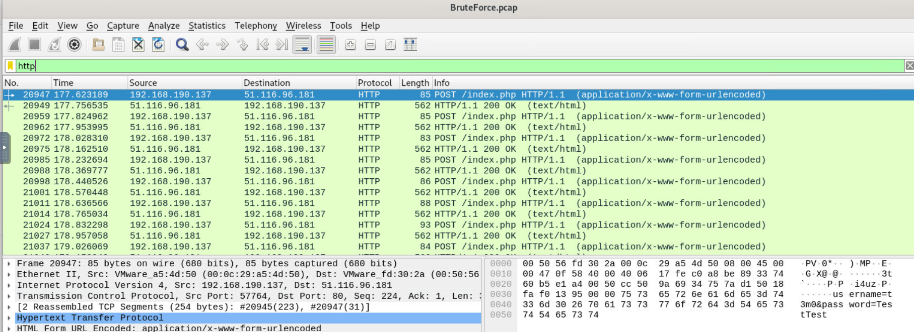
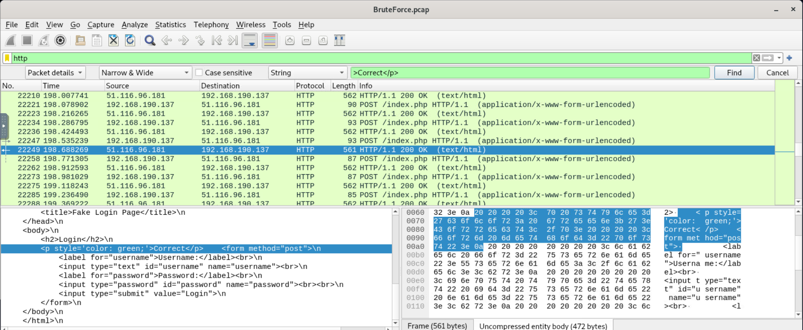
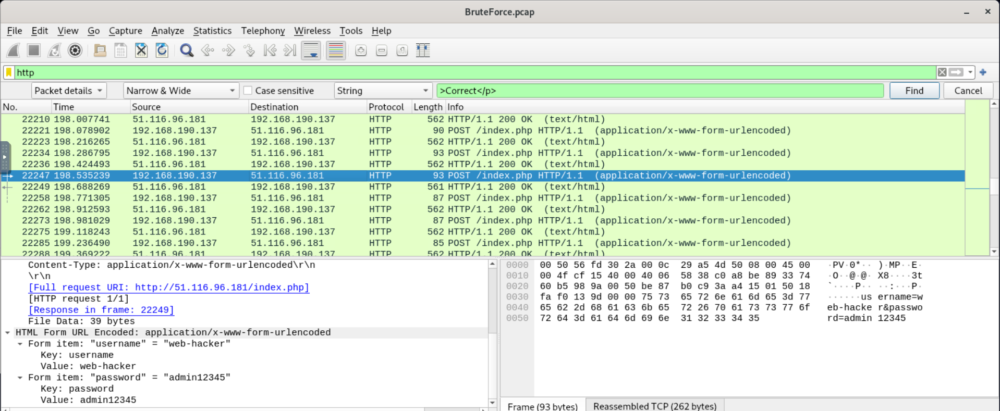
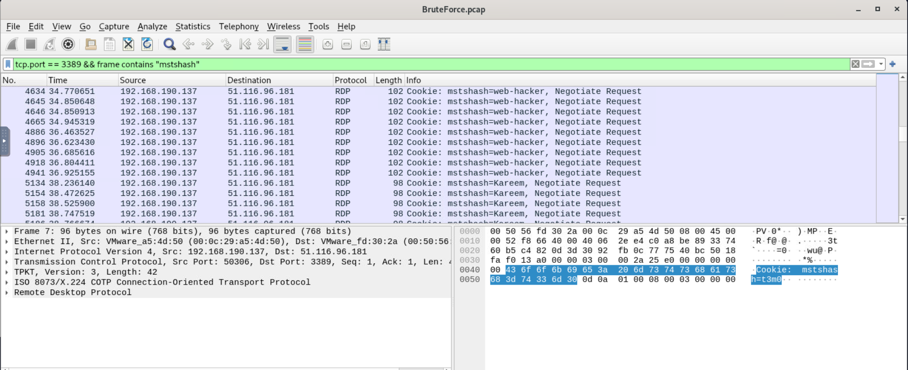
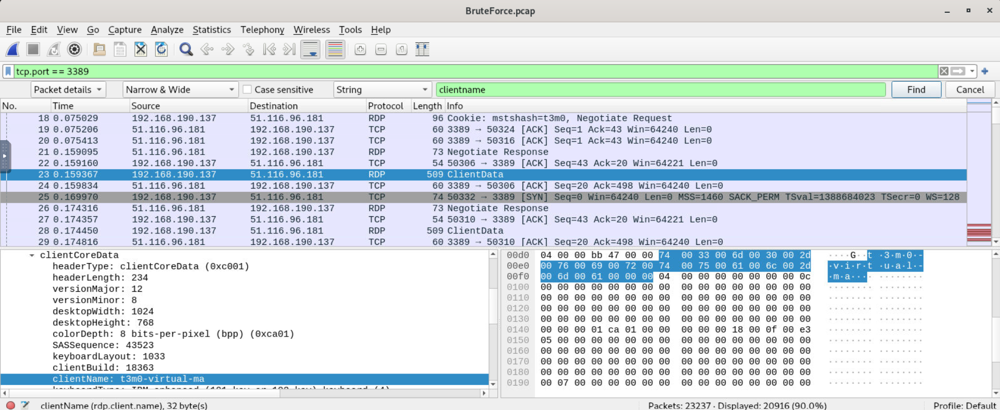
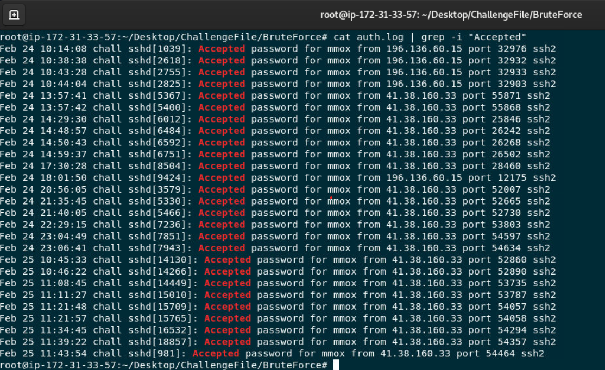
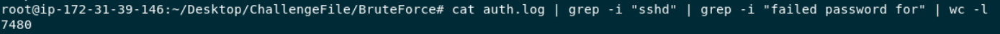
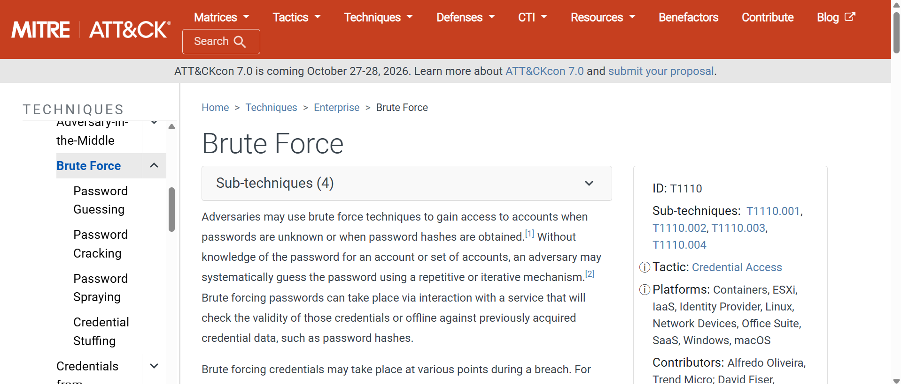

# LetsDefend — Brute Force Attacks Challenge

## 📝 Executive Summary
This report documents the digital forensics and investigation of a brute-force attack campaign directed against a corporate web server and system infrastructure. By analyzing network packet captures (`BruteForce.pcap`) and system authentication records (`auth.log`), the investigation traces the attacker's footprints across different layers, uncovering the target server, web-based brute-force metrics, RDP reconnaissance, and the compromised credentials.

---

## 🛠️ Lab Setup & Data Extraction
Before beginning the investigation, the challenge files were provided in a compressed `.7z` archive. I utilized the Linux CLI to extract the dataset:

```bash
# Extracting the lab files using 7z
7z x ChallengeFile.7z -o./BruteForce_Lab
```

🔍 Investigation Tasks
---

**Task 1**: Identifying the Target Server IP

**Question: What is the IP address of the server targeted by the attacker's brute-force attack?**

**Analysis & Methodology**
To locate the target server, I analyzed the network traffic statistics within Wireshark by navigating to Statistics -> Conversations -> TCP.

By examining the connection frequencies and data volumes, a significant pattern emerged involving two primary hosts: 192.168.190.137 (Attacker) and 51.116.96.181 (Target). The host 192.168.190.137 initiated an anomalous number of parallel TCP connections across multiple source ports targeted at a single destination IP address. This behavior is indicative of automated scanning and brute-force traffic.


***Figure 1**: Analyzing TCP conversations to identify the anomaly and target IP.*

**Answer:** 51.116.96.181

---

**Task 2**: Investigating Web-Based Brute-Force Activity

**Question: Which directory/file was targeted by the attacker's brute-force attempt?**

**Analysis & Methodology**
To investigate potential web application attacks, I analyzed the HTTP traffic inside Wireshark by applying the protocol filter: http.

**Solution Steps**

**Step 1: Filtering HTTP Traffic** Applied the specific protocol filter `http` inside Wireshark to isolate all web application traffic and filter out noise from other network layers.

**Step 2: Analyzing Request Patterns** The packet capture revealed an anomalous, dense stream of repetitive HTTP POST requests originating from the attacker's machine (`192.168.190.137`) and directed toward the target web server.

**Step 3: Inspecting Payload Details & Target File** By examining the packet details (specifically Frame 20947), the target was identified as the local directory file `/index.php`. Further inspection of the "HTML Form URL Encoded" section exposed automated login payloads transmitting credentials (e.g., `username=t3m0&password=TestTest`), confirming an aggressive web brute-force campaign.


***Figure 2**: Wireshark capture showing consecutive HTTP POST requests targeting /index.php.*

**Answer**: index.php

---

**Task 3**: Identifying Compromised Credentials

**Question: Identify the correct username and password combination used for a successful login.**

**Analysis & Methodology**
To efficiently locate the compromised credentials without scanning thousands of failed attempts, I targeted specific HTTP status success indicators rendered by the web application.

**Solution Steps**

**Step 1: Configuring the Search Indicator** Opened Wireshark's Find Packet tool (`Ctrl + F`), setting the Search Type to `String` and searching within `Packet details`. 

**Step 2: Hunting the Success Criteria** Used the search term `>Correct</p>` to isolate the exact HTML green success message rendered upon valid authentication.

**Step 3: Locating the Frame** The search instantly pinpointed **Frame 22249** (`HTTP/1.1 200 OK`) containing the success payload in its response body.

**Step 4: Extracting Credentials** Traced the associated HTTP POST request in **Frame 22247** (linked via response metadata) to expose the raw URL-encoded form data.


***Figure 3**: Identification of successful web authentication and credential extraction.*


***Figure 4**: Identification of successful web authentication and credential extraction.*

**Answer:** `web-hacker:admin12345`

---

**Task 4**: Evaluating RDP Target Scope

**Question: Determine how many unique user accounts the attacker attempted to compromise via RDP brute-force.**

**Analysis & Methodology**
I isolated the RDP handshake layer to extract specific session attributes and cross-referenced them with local authentication logs to identify unique targeting vectors.

**Solution Steps**

**Step 1: Intercepting RDP Traffic** Applied the network filter `tcp.port == 3389` to trap RDP connection cookies (`mstshash`) containing the target account names transmitted in the `.pcap` capture.

**Step 2: Cross-Matching against Local Logs** Cross-referenced the captured names against the Linux host's `auth.log`. Active system accounts (like `mmox` and `web-hacker`) were filtered out as they belonged to separate SSH/Web attack vectors.

**Step 3: Isolating RDP-Exclusive Sessions** Isolated accounts strictly bounded to port 3389 (such as `Mohamed`, `Mohsen`, and `Ali`) which never appeared in local system authentication logs.


***Figure 5**: Cross-referencing active RDP connection cookies against system logs.*

**Answer:** `7`

---

**Task 5**: Identifying the Attacker's Machine (clientName)

**Question: Find the explicit "clientName" of the attacker's machine used during the RDP connection attempts.**

**Analysis & Methodology**
During RDP handshakes, the client system transmits local workstation metadata inside the `clientCoreData` structure. I audited this layer to find the attacker's persistent hostname.

**Solution Steps**

**Step 1: Filtering Handshake Metadata** Applied the filter `tcp.port == 3389` and used the Find Packet tool (`Ctrl + F`) to run a `String` search inside `Packet details` for the keyword `clientname`.

**Step 2: Extracting Workstation Properties** The search located **Frame 23** (`Protocol: RDP / Info: ClientData`). Expanding the packet tree node `Remote Desktop Protocol` -> `clientCoreData` exposed the decoded client properties.


***Figure 6**: Extracting the attacker's workstation hostname from the RDP clientCoreData structure.*

**Answer:** `t3m0-virtual-ma`

---

**Task 6**: SSH Last Successful Login Analysis

**Question: Identify the user who last successfully logged in via SSH and the exact timestamp of the event.**

**Analysis & Methodology**
Linux security subsystems append authentication milestones chronologically to the local log file. I isolated the latest state entry indicating verified interactive SSH access.

**Solution Steps**
**Step 1: Isolating Approved Sessions** Executed a targeted string isolation on the log file via the Linux terminal to filter for verified access milestones:
  ```bash
  cat auth.log | grep -i "Accepted"
  ```
**Step 2: Parsing Chronological State** Navigated to the bottom-most line of the generated output (representing the most recent historical event) to extract the final recorded session parameters:


***Figure 7**: Parsing auth.log for verified SSH interactive authentication timestamps.*

**Answer:** mmox:11:43:54

---

**Task 7**: Counting Unsuccessful SSH Connection Attempts

**Question: Determine the total number of unsuccessful SSH connection attempts made by the attacker against the system.**

**Analysis & Methodology**
The Secure Shell Daemon (sshd) logs every single rejected password phase under a standard explicit error format. I used an industrial log parsing pipeline to count these entries.

**Solution Steps**

**Step 1**: Building the Log Pipeline Crafted a piped command utility to filter out extraneous system telemetry and isolate failed credential events:

```bash
cat auth.log | grep -i "sshd" | grep -i "failed password for" | wc -l
```

**Step 2: Processing the Filters**
```bash
cat auth.log: Streams the raw system authentication logs.

grep -i "sshd": Focuses solely on the SSH daemon tracking.

grep -i "failed password for": Isolates rows where a password attempt was explicitly rejected.

wc -l: Counts the matching line variables to determine the metric score.
```


***Figure 8:** Executing log parsing strings to determine total rejected authentication attempts.*

**Answer:** 7480

---

**Task 8:** Mapping to MITRE ATT&CK Framework

**Question: Identify the specific MITRE ATT&CK technique ID used by the attacker to gain initial access to the system.**

**Analysis & Methodology**
By compiling the tactical markers gathered across the forensic evidence—including 7,480 failed SSH logs, parallel RDP sweeping, and automated web POST patterns—I mapped the adversarial actions to standardized framework profiles.

**Solution Steps**

**Step 1:** Classifying Adversarial Behavior The systematic cycling through automated credential sheets or stuffing combinations across various network services is universally classified as brute-forcing.

**Step 2:** Attributing Framework Identifiers Mapped the attack pattern to the Initial Access and Credential Access tactics within the MITRE ATT&CK Matrix.


***Figure 9:** Mapping observed telemetry to the MITRE ATT&CK Matrix technique ID.*

**Answer: T1110**
